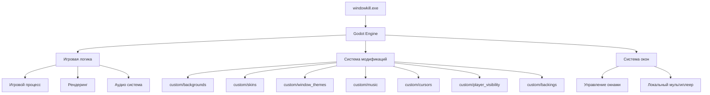
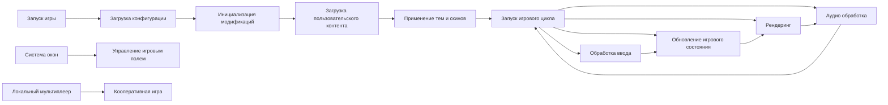
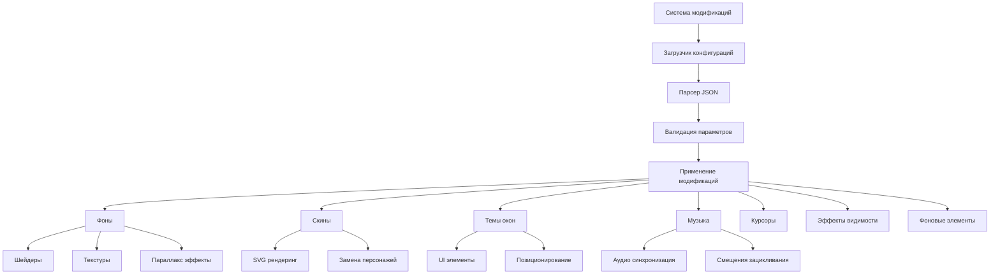
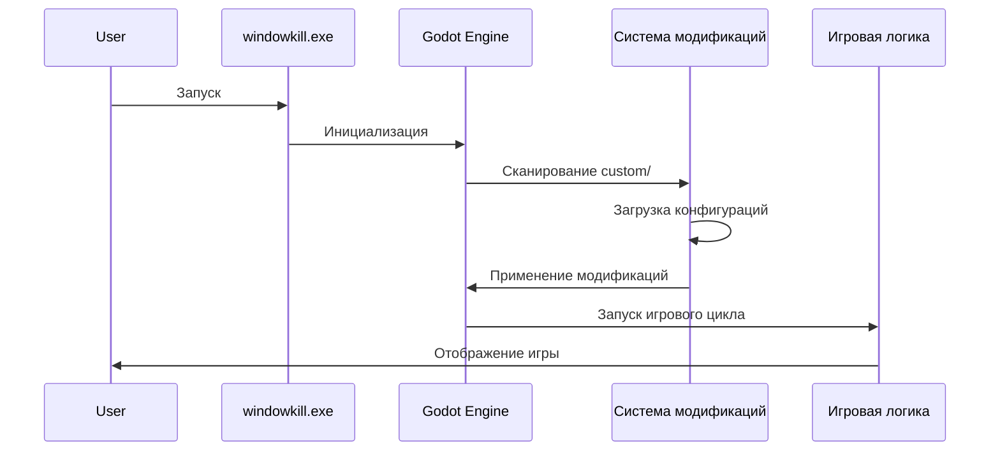

Эта игра буквально использует окна на твоём компьютере как игровое поле. Вин-стик шутер, в котором границы игрового окна постоянно приближаются к вам. Атакуйте границы окна чтобы двигать его по экрану, постепенно прокачиваясь и сражаясь с боссами в других окнах.

В игре еще есть локальный мультиплеер и моды. Приятной игры)

## 📋 Содержание
1. [Структура проекта](#структура-проекта)
2. [Описание файлов](#описание-файлов)
3. [Архитектура проекта](#архитектура-проекта)
4. [Библиотеки/фреймворки](#библиотекифреймворки)
5. [Точка входа и запуск](#точка-входа-и-запуск)
6. [Архитектурные особенности](#архитектурные-особенности)

---

## 🗂️ Структура проекта

### Дерево файлов и папок

```
Windowkill/
├── 📁 custom/                          # Пользовательские модификации
│   ├── 📁 backgrounds/                 # Фоновые изображения
│   │   ├── 📁 circuit/                 # Схематический фон
│   │   │   ├── bg.png                  # Фоновое изображение
│   │   │   └── config.json             # Конфигурация фона
│   │   ├── 📁 marble/                  # Мраморный фон
│   │   │   ├── bg_custom_test.gdshader # Шейдер для фона
│   │   │   ├── config.json             # Конфигурация фона
│   │   │   └── noise.jpg               # Текстурная карта
│   │   └── 📁 thump/                   # Пульсирующий фон
│   │       ├── bg.gdshader             # Шейдер для фона
│   │       └── config.json             # Конфигурация фона
│   ├── 📁 backings/                    # Фоновые элементы
│   │   └── 📁 type/                    # Типографический фон
│   │       ├── bg.png                  # Фоновое изображение
│   │       └── config.json             # Конфигурация фона
│   ├── 📁 cursors/                     # Пользовательские курсоры
│   │   └── 📁 kitty/                   # Котик-курсор
│   │       ├── cursor.png              # Изображение курсора
│   │       ├── cursor.png.import       # Импорт-файл Godot
│   │       └── config.json             # Конфигурация курсора
│   ├── 📁 music/                       # Пользовательская музыка
│   │   └── 📁 windowframe/             # Музыкальная тема
│   │       ├── music.ogg               # Аудиофайл
│   │       └── config.json             # Конфигурация музыки
│   ├── 📁 player_visibility/           # Настройки видимости игрока
│   │   └── 📁 clickbait/               # Эффект видимости
│   │       ├── image.png               # Изображение эффекта
│   │       └── config.json             # Конфигурация эффекта
│   ├── 📁 skins/                       # Скины персонажей
│   │   └── 📁 sad/                     # Грустный скин
│   │       ├── bg.svg                  # Фоновый SVG
│   │       ├── fg.svg                    # Передний SVG
│   │       └── config.json              # Конфигурация скина
│   └── 📁 window_themes/                # Темы окон
│       └── 📁 pixel/                    # Пиксельная тема
│           ├── close.png                # Кнопка закрытия
│           ├── closePress.png           # Кнопка закрытия (нажата)
│           ├── config.json              # Конфигурация темы
│           ├── controls.png             # Элементы управления
│           ├── frame.png                # Рамка окна
│           └── frameUnfocused.png       # Рамка окна (не в фокусе)
├── 📁 mods/                            # Папка для модов (пустая)
├── 🔧 Steam_api64.dll                  # Библиотека динамической компоновки
├── 🔧 godotsteam.x86_64.dll            # Библиотека динамической компоновки
└── 🎮 windowkill.exe                   # Основной исполняемый файл
```

---

## 📄 Описание файлов

### Основные исполняемые файлы

#### `windowkill.exe` (102 MB)
- **Назначение**: Основной исполняемый файл игры Windowkill
- **Ключевые функции**: Точка входа в приложение, игровой движок
- **Связи**: Использует систему модификаций и пользовательский контент
- **Логика**: Скомпилированная игра на движке Godot, содержащая всю игровую логику

### Пользовательские модификации (custom/)

#### Фоны (backgrounds/)

**circuit/**
- `bg.png`: Схематический фоновый рисунок
- `config.json`: 
  ```json
  {
    "name": "circuit",
    "author": "torcado",
    "mode": "tile",
    "parallax": -0.2
  }
  ```
  - **Режим**: Плиточное повторение
  - **Параллакс**: -0.2 (медленное движение фона)

**marble/**
- `bg_custom_test.gdshader`: Шейдер для мраморного эффекта
- `noise.jpg`: Текстурная карта для шейдера
- `config.json`: Базовая конфигурация без специальных параметров

**thump/**
- `bg.gdshader`: Шейдер с аудио-реактивностью
- `config.json`:
  ```json
  {
    "name": "thump",
    "author": "torcado",
    "shader_composite": true,
    "shader_audio": true
  }
  ```
  - **Аудио-реактивность**: Шейдер реагирует на музыку
  - **Композитный режим**: Специальный режим рендеринга

#### Скины (skins/)

**sad/**
- `bg.svg`, `fg.svg`: Векторные изображения скина
- `config.json`:
  ```json
  {
    "name": "sad",
    "author": "torcado",
    "character": ":)",
    "replace": true
  }
  ```
  - **Персонаж**: Смайлик ":)"
  - **Замена**: Полная замена стандартного скина

#### Темы окон (window_themes/)

**pixel/**
- `frame.png`, `frameUnfocused.png`: Рамки окон
- `close.png`, `closePress.png`: Кнопки закрытия
- `controls.png`: Элементы управления
- `config.json`:
  ```json
  {
    "name": "pixel",
    "author": "keestak",
    "frameWidths": {
      "left": 4, "right": 4, "top": 34, "bottom": 4
    },
    "closeExpand": 0,
    "titleBarHeight": 32,
    "titleCentered": false,
    "titleColor": "#000000",
    "iconOffset": {"x": 4, "y": -7},
    "controlsOffset": {"x": 4, "y": -4}
  }
  ```
  - **Размеры рамки**: Точные размеры для пиксельной темы
  - **Цвет заголовка**: Черный
  - **Смещения**: Точное позиционирование элементов

#### Музыка (music/)

**windowframe/**
- `music.ogg`: Аудиофайл музыкальной темы
- `config.json`:
  ```json
  {
    "name": "windowframe",
    "author": "keestak",
    "loop_offset": 44.188,
    "boss_offset": 71.99
  }
  ```
  - **Смещение зацикливания**: 44.188 секунд
  - **Смещение босса**: 71.99 секунд

#### Курсоры (cursors/)

**kitty/**
- `cursor.png`: Изображение котика-курсора
- `cursor.png.import`: Файл импорта Godot
- `config.json`:
  ```json
  {
    "name": "kitty",
    "author": "torcado",
    "center": {"x": 30, "y": 8},
    "scale": 3
  }
  ```
  - **Центр курсора**: Смещение точки клика
  - **Масштаб**: 3x увеличение

---

## 🏗️ Архитектура проекта

### Общая структура

Windowkill построен на движке Godot и использует модульную архитектуру с системой пользовательских модификаций. Проект разделен на несколько ключевых компонентов:



### Потоки данных



### Система модификаций



---

## 📚 Библиотеки/фреймворки

### Godot Engine
- **Назначение**: Игровой движок
- **Использование**: Рендеринг, физика, аудио, система модификаций, управление окнами
- **Особенности**: Поддержка шейдеров, SVG, модульная архитектура, кроссплатформенность

### Система управления окнами
- **Назначение**: Интеграция с операционной системой для управления окнами
- **Использование**: Создание игрового поля из реальных окон, взаимодействие с системными окнами
- **Особенности**: Прямое взаимодействие с оконной системой Windows

---

## 🚀 Точка входа и запуск

### Как запускается проект

1. **Запуск исполняемого файла**: `windowkill.exe`
2. **Инициализация движка**: Godot Engine загружает основные компоненты
3. **Загрузка модификаций**: Система сканирует папку `custom/`
4. **Применение конфигураций**: JSON-файлы конфигураций парсятся и применяются
5. **Запуск игрового цикла**: Основной игровой процесс начинается

### Что выполняется первым



---

## 🎯 Архитектурные особенности

### Нестандартные решения

1. **Модульная система модификаций**: Каждый тип контента (фоны, скины, темы) имеет собственную папку с конфигурацией
2. **JSON-конфигурации**: Все настройки хранятся в человекочитаемом формате
3. **Шейдерная система**: Поддержка кастомных шейдеров для фонов с аудио-реактивностью
4. **SVG-рендеринг**: Использование векторной графики для скинов

### Причины выбора архитектуры

1. **Простота модификации**: Пользователи могут легко создавать собственный контент
2. **Производительность**: Шейдеры обеспечивают эффективный рендеринг эффектов
3. **Кроссплатформенность**: Godot Engine работает на всех основных платформах
4. **Инновационность**: Уникальная концепция использования реальных окон как игрового поля

### Преимущества архитектуры

- ✅ **Модульность**: Легкое добавление новых модификаций
- ✅ **Производительность**: Оптимизированный рендеринг
- ✅ **Пользовательский контент**: Простая система создания модов
- ✅ **Кроссплатформенность**: Работает на Windows, Linux, macOS
- ✅ **Уникальность**: Инновационная концепция игры с реальными окнами
- ✅ **Локальный мультиплеер**: Возможность совместной игры
